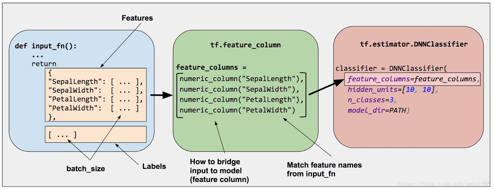
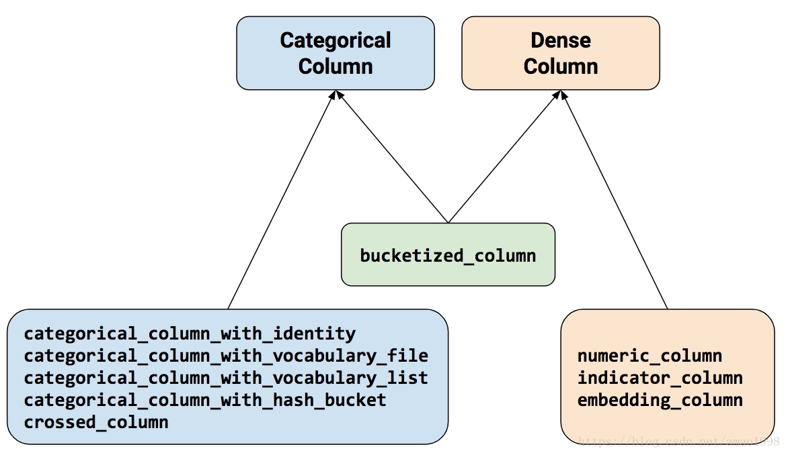

## Tensorflow编程概念    

基于图表的通用计算框架。  


## 概念：  

1. **张量** (tensor)：是任意维度的数组。  

   - **标量**是零维数组（零阶张量）。例如，`\'Howdy\'` 或 `5`
   - **矢量**是一维数组（一阶张量）。例如，`[2, 3, 5, 7, 11]` 或 `[5]`
   - **矩阵**是二维数组（二阶张量）。例如，`[[3.1, 8.2, 5.9][4.3, -2.7, 6.5]]`

   TensorFlow **指令**会创建、销毁和操控张量。典型 TensorFlow 程序中的大多数代码行都是指令。   

2. **图（计算图，数据流图）**：是一种图数据结构。很多TensorFlow程序由单个图构成。也可以选择创建多个图。图的节点是指令；图的边是张量。张量流经图，在每个节点由一个指令操控。一个指令的输出张量通常会变成后续指令的输入张量。TensorFlow 会实现**延迟执行模型**，意味着系统仅会根据相关节点的需求在需要时计算节点。   

   *张量可以作为**常量**或**变量**存储在图中。*常量和变量都只是图中的一种指令 。常量是始终会返回同一张量值的指令。变量是会返回分配给它的任何张量的指令。

   要定义常量，请使用 `tf.constant` 指令，并传入它的值。例如：

   ```python
     x = tf.constant([5.2])
   ```

   同样，您可以创建如下变量：

   ```python
     y = tf.Variable([5])
   ```

   或者，您也可以先创建变量，然后再如下所示地分配一个值（注意：您始终需要指定一个默认值）：

   ```python
     y = tf.Variable([0])
     y = y.assign([5])
   ```

   定义一些常量或变量后，您可以将它们与其他指令（如 `tf.add`）结合使用。在评估 `tf.add` 指令时，它会调用您的 `tf.constant` 或 `tf.Variable` 指令，以获取它们的值，然后返回一个包含这些值之和的新张量。

   图必须在 TensorFlow **会话**中运行，会话存储了它所运行的图的状态：

   ```python
   将 tf.Session() 作为会话：
     initialization = tf.global_variables_initializer()
     print y.eval()
   ```

   在使用 `tf.Variable` 时，您必须在会话开始时调用 `tf.global_variables_initializer`，

   **注意：**会话可以将图分发到多个机器上执行（假设程序在某个分布式计算框架上运行）。 

### 总结

TensorFlow 编程本质上是一个两步流程：

1. 将常量、变量和指令整合到一个图中。
2. 在一个会话中评估这些常量、变量和指令。

-----------------------------------------

除了import tensorflow以外，其他常见的 import 语句包括：

```python
import matplotlib.pyplot as plt # 数据集可视化。
import numpy as np              # 低级数字 Python 库。
import pandas as pd             # 较高级别的数字 Python 库。
```

--------------------------------------------------

## 创建和操控张量：    

### 矢量加法：  

以下代码会创建和操控两个矢量（一维张量），每个矢量正好六个元素：

------

```python
#coding=utf-8
import tensorflow as tf 

with tf.Graph().as_default():
	#创建一个由6个元素的向量（1-D张量）。
	primes = tf.constant([2, 3, 4, 7, 11, 13], dtype=tf.int32)

	#创建另一个有6个元素的向量，每一个元素在向量中将被初始化为1.
	#第一个参数[6]是装量的形状，即向量维数，，表示6个元素。
	ones = tf.ones([6], dtype=tf.int32)

	#相加两个向量，结果张量是一个6个元素的向量。
	just_beyond_primes = tf.add(primes, ones)

	#创建一个会话去运行这个默认的图。
	with tf.Session() as sess:
		print just_beyond_primes.eval()

```

#### 张量形状：  

**形状（shape）**用于描述张量维度的大小和数量。张量的形状表示为`列表（list）`，其中第 `i` 个元素表示维度 `i` 的大小。列表的长度表示张量的阶（即维数）。 


```python
#一个标量（0-D张量）
scalar = tf.zeros([])
#一个3个元素的向量
vector = tf.zeros([3])

#一个2行3列的矩阵
matrix = tf.zeros([2, 3])

with tf.Session() as sess:
	print('scalar has shape', scalar.get_shape(), 'and value:\n', scalar.eval()
	print('vector has shape', vector.get_shape(), 'and value:\n', vector.eval()
	print('matrix has shape', matrix.get_shape(), 'and value:\n', matrix.eval()
```
#### 广播（broadcast）：  

在数学中，您只能对形状相同的张量执行元素级运算（例如，相加和等于）。不过，在 TensorFlow 中，您可以对张量执行传统意义上不可行的运算。TensorFlow 支持**广播**（一种借鉴自 Numpy 的概念）。利用广播，*元素级运算中的较小数组会增大到与较大数组具有相同的形状*。例如，通过广播（只要不超过需要的指令大小即可）：

* 如果指令需要大小为 [6] 的张量，则大小为 [1] 或 [] 的张量可以作为运算数。
* 如果指令需要大小为 [4, 6] 的张量，则以下任何大小的张量都可以作为运算数。
  * [1, 6]
  * [6]
  * []
* 如果指令需要大小为 [3, 5, 6] 的张量，则以下任何大小的张量都可以作为运算数。
  * [1, 5, 6]
  * [3, 1, 6]
  * [3, 5, 1]
  * [1, 1, 1]
  * [5, 6]
  * [1, 6]
  * [6]
  * [1]
  * []

**注意**：当张量被广播时，从概念上来说，系统会复制其条目（出于性能考虑，实际并不复制。广播专为实现性能优化而设计）。


```python
with tf.Graph().as_default():
	#创建一个由6个元素的向量（1-D张量）。
	primes = tf.constant([2, 3, 4, 7, 11, 13], dtype=tf.int32)
	#创建另一个有6个元素的向量，每一个元素在向量中将被初始化为1.
	#第一个参数[1]是装量的形状，这里只使用了1。
	ones = tf.ones([1], dtype=tf.int32)

	#相加两个向量，结果张量是一个6个元素的向量。
	just_beyond_primes = tf.add(primes, ones)

	#创建一个会话去运行这个默认的图。
	with tf.Session() as sess:
		print(just_beyond_primes.eval())
```


### 矩阵乘法：  

在线性代数中，当两个矩阵相乘时，第一个矩阵的*列*数必须等于第二个矩阵的*行*数。

- `3x4` 矩阵乘以 `4x2` 矩阵是**有效**的，可以得出一个 `3x2` 矩阵。
- `4x2` 矩阵乘以 `3x4` 矩阵是**无效**的。


```python
#矩阵乘法
#创建一个3行4列的矩阵（2-d张量）
x = tf.constant([[5, 2, 4, 3], [5, 1, 6, -2], [-1, 3, -1, -2]], dtype=tf.int32)
#创建一个4行3列的矩阵
y = tf.constant([[2, 2], [3, 5], [4, 5], [1, 6]], dtype=tf.int32)

#x和y相乘
#得到一个3行2列的矩阵
matrix_multiply_result = tf.matmul(x, y)
with tf.Session() as sess:
    print matrix_multiply_result.eval()

```

  ### 张量变形：  

由于张量加法和矩阵乘法均对运算数施加了限制条件，TensorFlow 编程者肯定会频繁改变张量的形状。

您可以使用 `tf.reshape` 方法改变张量的形状。 例如，您可以将 8x2 张量变形为 2x8 张量或 4x4 张量：

```python
#张量变形
# Create an 8x2 matrix (2-D tensor).
matrix = tf.constant([[1,2], [3,4], [5,6], [7,8], [9,10], [11,12], [13, 14], [15,16]], dtype=tf.int32)
# Reshape the 8x2 matrix into a 2x8 matrix.
reshaped_2x8_matrix = tf.reshape(matrix, [2,8])
# Reshape the 8x2 matrix into a 4x4 matrix
reshaped_4x4_matrix = tf.reshape(matrix, [4,4])

with tf.Session() as sess:
	print("Original matrix (8x2):")
	print(matrix.eval())
	print("Reshaped matrix (2x8):")
	print(reshaped_2x8_matrix.eval())
	print("Reshaped matrix (4x4):")
	print(reshaped_4x4_matrix.eval())
```
此外，您还可以使用 `tf.reshape` 更改张量的维数（\'阶\'）。 例如，您可以将 8x2 张量变形为三维 2x2x4 张量或一维 16 元素张量。 

### 变量、初始化和赋值：  

我们执行的所有运算都是针对静态值 (`tf.constant`) 进行的；调用 `eval()` 始终返回同一结果。在 TensorFlow 中可以定义 `Variable` 对象，它的值是可以更改的。

创建变量时，您可以明确设置一个初始值，也可以使用初始化程序（例如分布）：  

```python
g = tf.Graph()
with g.as_default():
    #Create a variable with the initial value 3.
	v = tf.Variable([3])
	#Create a variable of shape [1], with a random initial value,
	#sampled from a normal distribution with mean 1 and standard deviation 0.35.
	w = tf.Variable(tf.random_normal([1], mean=1.0, stddev=0.35))

```

TensorFlow 的一个特性是**变量初始化不是自动进行的**。   

要初始化变量，最简单的方式是调用 `global_variables_initializer`。请注意 `Session.run()` 的用法（与 `eval()` 的用法大致相同）。   

```python
with g.as_default():
	with tf.Session() as sess:
   		initialization = tf.global_variables_initializer()
		sess.run(initialization)
		#这样，变量就能够被正常的接受，并分配值给他们。
		print v.eval()
		print w.eval()

```

初始化后，变量的值保留在同一会话中（不过，当您启动新会话时，需要重新初始化它们） 。  

要更改变量的值，请使用 `assign` 指令。请注意，仅创建 `assign` 指令不会起到任何作用。和初始化一样，您必须`运行`赋值指令才能更新变量值：   

```python
import tensorflow as tf

#task2：假设模拟投掷两个骰子 10 次。
#创建一个骰子模拟，在模拟中生成一个 10x3 二维张量，其中：
#列 1 和 2 均存储一个骰子的一次投掷值。
#列 3 存储同一行中列 1 和 2 的值的总和。
#例如，第一行中可能会包含以下值：
#列 1 存储 4
#列 2 存储 3
#列 3 存储 7
with tf.Graph().as_default(), tf.Session() as sess:
    dics1 = tf.Variable(tf.random_uniform([10,1], minval=1, maxval=7,
                                                  dtype=tf.int32))
	dics2 = tf.Variable(tf.random_uniform([10,1], minval=1, maxval=7,
                                                  dtype=tf.int32))
	dics_sum = tf.add(dics1, dics2)
	resulting_matrix = tf.concat(values=[dics1, dics2, dics_sum], axis=1)
  	sess.run(tf.global_variables_initializer())
	print(resulting_matrix.eval())


```

------------------------------

## 工具包：  


### tf.estimator API：    

线性回归程序的格式： 

```python
import tensorflow as tf

# Set up a linear classifier.
classifier = tf.estimator.LinearClassifier()

# Train the model on some example data.
classifier.train(input_fn=train_input_fn, steps=2000)

# Use it to predict.
predictions = classifier.predict(input_fn=predict_input_fn)
```

 

| 工具包                         | 说明                               |
| ------------------------------ | ---------------------------------- |
| Estimator (tf.estimator)       | 高级 OOP（面向对象程序设计） API。 |
| tf.layers/tf.losses/tf.metrics | 用于常见模型组件的库。             |
| TensorFlow                     | 低级 API                           |

TensorFlow 由以下两个组件组成：

- [图协议缓冲区](https://www.tensorflow.org/extend/tool_developers/#protocol_buffers)
- 执行（分布式）图的运行时

这两个组件类似于 Java 编译器和 JVM。正如 JVM 会实施在多个硬件平台（CPU 和 GPU）上一样，TensorFlow 也是如此。

-----------------------------------------------

## 特征列：  

主要解决对用户数据进行预处理与特征化的处理。

通过Estimator的`feature_columns`参数指定模型的输入。特征列在输入数据（由`input_fn`返回）与模型之间架起了桥梁。  



TF的特征列构造由`tensorflow.feature_column`模块来提供，生成的数据将会作为模型的`feature_columns`参数被传递给模型。 创建特征列，需要调用 [`tf.feature_column`](https://www.tensorflow.org/api_docs/python/tf/feature_column) 模块的函数。 关键语句为：  

```python
tf.feature_column.numeric_column(key=key)
```

该模块有9个函数：所有九个函数都会返回一个 Categorical-Column 或一个 Dense-Column 对象，但却不会返回 `bucketized_column`，后者继承自这两个类：

