[TOC]


## 问题构建（Framing）：  

### 什么是（监督式）机器学习：  

* 通过学习*如何组合输入信息*来对从未见过的数据做出有用的**预测**。  
  * Labels（标签）：指我们要预测的真实事物：**y**
    * 基本线性回归中的y变量。	  
  * Features（特征）：表示数据的方式，指用于描述数据的输入变量：**$x_i$**。
    * 基本线性回归中的${x_1, x_2,x_3,...,x_n}$。 
  * Sample(样本)：指数据的特定实例（为一个矢量）：**x**.
    * 有标签：具有{特征，标签}：（**x**，**y**）：用于训练模型。
    * 无标签：具有{特征，？}：（**x**，？）：用于对新数据做出预测。
  * Model（模型）：将样本映射到预测标签：**y'**
    * **执行预测的工具**。通过从数据债学习规律这一过程来尝试创建模型。
    * 由模型的内部参数定义，这些内部参数值是通过学习得到的。

## 深入了解机器学习（Descending into ML）：  

### **线性回归**：是一种找到最合适一组点的直线或超平面的方法。

$$ y = wx +b $$  

$w$为权重矢量（直线斜率）。$b$为偏差。

误差（loss ）（针对单个样本，采用模型的预测结果与真实值之间的方差）：  

给定样本的 **L2 损失**也称为平方误差

​	= 预测值和标签值之差的平方

​	= (观察值 - 预测值)2

​	= (y - y')2  

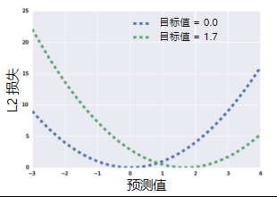

**定义数据集上的 L2 损失**(方差)

$$L_2Loss = \sum_{(x,y)\in D} (y - prediction(x))^2$$

*不是专注于减少某一个样本，而是着眼于最大限度地减少整个数据集的误差。*

### 训练与损失  

**训练**模型表示通过有标签的样本来学习（确定）所有权重和偏差的理想值。在监督学习中，ML通过以下方式构建模型：  *检查多个样本并尝试找出最大限度地减少损失的模型----**经验风险最小化**。*

**损失**是对错误预测的惩罚。他是一个*数值*，表示对于单个样本而言模型预测的准确程度。训练模型的目标是从所有样本中找到一组平均损失“较小”的权重和偏差。

常见损失（平方损失）：  

**均方误差** (**MSE**) 指的是每个样本的*平均平方损失*。要计算 MSE，需要求出各个样本的所有平方损失之和，然后除以样本数量：

 $$MSE = \frac{1}{N} \sum_{(x,y)\in D} (y - prediction(x))^2$$

其中，

* $(x,y)$指的是样本，其中

  * $x$指的是模型进行预测时使用的特征集（例如，温度、年龄和交配成功率）。
  * $y$指的是样本的标签（例如，每分钟的鸣叫次数）（也就是真实值）。

* $prediction(x)$指的是权重和偏差与特征集 $x$结合的函数（使用模型预测得到的值）。

* $D$指的是包含多个有标签样本（即 $(x,y)$）的数据集。

* $N$指的是 $D$ 中的样本数量。

  虽然 MSE 常用于机器学习，但它既不是唯一实用的损失函数，也不是适用于所有情形的最佳损失函数。

## 降低损失（Reducing Loss）：  

迭代方法是一种广泛用于降低损失的方法，使用起来也简单有效。  

### 如何降低损失？  

梯度：与模型参数相关的误差函数的导数。

- $(y - y')2$ 相对于权重和偏差的导数可让我们了解指定样本的损失变化情况

- - 易于计算且为凸形

- 因此，我们在能够尽可能降低损失的方向上反复采取小步

- - 我们将这些小步称为**梯度步长**（但它们实际上是负梯度步长）
  - 这种优化策略称为**梯度下降法**  

#### 梯度下降法示意图：  

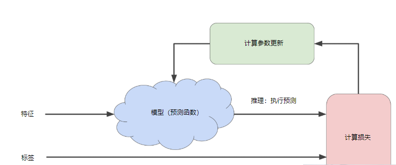

### 权重初始化:

- 对于凸形问题，权重可以从任何位置开始（比如，所有值为 0 的位置）

- - 凸形：想象一个碗的形状
  - 只有一个最低点

- 预示：不适用于神经网络

- - 非凸形：想象一个蛋托的形状
  - 有多个最低点
  - 很大程度上取决于初始值

### SGD 和小批量梯度下降法

- 可以在每步上计算整个数据集的梯度，但事实证明没有必要这样做

- 计算小型数据样本的梯度效果很好

- - 每一步抽取一个新的随机样本

- **随机梯度下降法**：一次抽取一个样本

- **小批量梯度下降法**：每批包含 10-1000 个样本

- - 损失和梯度在整批范围内达到平衡

*通常，可以不断迭代，直到总体损失不再变化或至少变化极其缓慢为止。这时候，我们可以说该模型已**收敛**。*  

**要点：**

在训练机器学习模型时，首先对权重和偏差进行初始猜测，然后反复调整这些猜测，直到获得损失可能最低的权重和偏差为止。

---------------------------------------------------

### 降低损失 (Reducing Loss)：梯度下降法:  


凸形问题只有一个最低点；即只存在一个斜率正好为 0 的位置。这个最小值就是损失函数收敛之处，也可以称这个最低点为**全局最小值**。

但是，通过计算整个数据集中 w1 每个可能值的损失函数来找到收敛点这种方法效率太低。

因此可以研究一种更好的机制，这种机制在机器学习领域非常热门，称为**梯度下降法**。  

**梯度**是偏导数的矢量；它可以让您了解哪个方向距离目标“更近”或“更远”。   

梯度是一个矢量，因此具有以下两个特征：

- 方向
- 大小

梯度始终指向损失函数中增长最为迅猛的方向。梯度下降法算法会沿着**负梯度**的方向走一步，以便尽快降低损失。  

### 降低损失 (Reducing Loss)：学习速率:  

梯度矢量具有方向和大小。梯度下降法算法用梯度乘以一个称为**学习速率**（有时也称为**步长**）的标量，以确定下一个点的位置。   

每个回归问题都存在一个[金发姑娘](https://wikipedia.org/wiki/Goldilocks_principle)学习速率。“金发姑娘”值与损失函数的平坦程度相关。如果您知道损失函数的梯度较小，则可以放心地试着采用更大的学习速率，以补偿较小的梯度并获得更大的步长 。  

-------------------------------------------------------------------

一维空间中的理想学习速率是 $\frac1{f(x)″}$（f(x) 对 x 的二阶导数的倒数）。

二维或多维空间中的理想学习速率是[海森矩阵](https://wikipedia.org/wiki/Hessian_matrix)（由二阶偏导数组成的矩阵）的倒数。

广义凸函数的情况则更为复杂。    

---------------------------------

### 降低损失 (Reducing Loss)：随机梯度下降法:  

* **批量（batch）**指的是用于在单次迭代中计算梯度的样本总数。   

* 包含随机抽样样本的大型数据集可能包含冗余数据。实际上，批量大小越大，出现冗余的可能性就越高。一些冗余可能有助于消除杂乱的梯度，但超大批量所具备的预测价值往往并不比大型批量高。 

* 通过从我们的数据集中随机选择样本，我们可以通过小得多的数据集估算（尽管过程非常杂乱）出较大的平均值。

*  **随机梯度下降法** (**SGD**) 将这种想法运用到极致，它每次迭代只使用一个样本（批量大小为 1）。如果进行足够的迭代，SGD 也可以发挥作用，但过程会非常杂乱。“随机”这一术语表示构成各个批量的一个样本都是随机选择的。 

* **小批量随机梯度下降法**（**小批量 SGD**）是介于全批量迭代与 SGD 之间的折衷方案。小批量通常包含**10-1000**个随机选择的样本。小批量 SGD 可以减少 SGD 中的杂乱样本数量，但仍然比全批量更高效。 

     

--------------------------------------

**有适用于模型调整的标准启发法吗？**
这是一个常见的问题。简短的答案是，**不同超参数的效果取决于数据**。因此，不存在必须遵循的规则，您需要对自己的数据进行测试。

即便如此，我们仍在下面列出了几条可为您提供指导的经验法则：

* 训练误差应该稳步减小，刚开始是急剧减小，最终应随着训练收敛达到平稳状态。
* 如果训练尚未收敛，尝试运行更长的时间。
* 如果训练误差减小但速度过慢，则提高学习速率也许有助于加快其减小速度。
  * 但有时如果学习速率过高，训练误差的减小速度反而会变慢。
* 如果训练误差变化很大，尝试降低学习速率。
  * 较低的学习速率和较大的步数/较大的批量大小通常是不错的组合。*
* 批量大小过小也会导致不稳定情况。不妨先尝试 100 或 1000 等较大的值，然后逐渐减小值的大小，直到出现性能降低的情况。

重申一下，切勿严格遵循这些经验法则，因为效果取决于数据。请始终进行试验和验证。  

--------------------------------------------------------------------------------------

### 识别离群值：  

在源数据中可能会存在一些异常数据影响模型的预测结果，可以称这些数据为**离群值**，也可说是偏离了源数据分布的一些值。


如上图右侧的个别点。由于点相对数量较小，故判断他们为离群值。

可以通过将这些离群值设置为相对合理的最小值或最大值来改进模型拟合情况。

例如初始情况，rooms_per_person的范围为0-8.右侧有几个离群值点：


通过下述rooms_per_person的直方图所示，发现大多数值都小于5，故将值截取为5.


在截取为5后的结果：


会发现少了那些离群值的影响，最后的数据分布看起来更加容易通过我们的模型来进行拟合。  

------------------------------------------------------------------------------

## 泛化（Generalization）：过拟合的风险  

**泛化** 指的是模型很好地拟合以前从没有见过的新数据（从用于创建该模型的同一分布中提取）的能力。也就是对测试数据的预测能力。      

**过拟合**模型在训练过程中产生的损失很低，但在预测新数据方面的表现却非常糟糕。  

*机器学习的基本冲突是适当拟合我们的数据，但也要尽可能简单地拟合数据*。  


### 概览：    

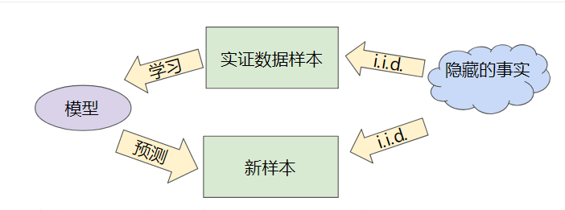

- 目标：针对从真实概率分布（已隐藏）中抽取的新数据做出良好预测。

- 问题：我们无法了解事实。

- - 我们只能从训练集中抽样。

- 如果模型 h 在拟合我们的当前样本方面表现良好，那么我们如何相信该模型会对其他新样本做出良好预测呢？   

### 我们如何得知自己的模型是否出色？

- 理论上：

- - 有趣的领域：泛化理论
  - 基于衡量模型简单性/复杂性的想法

- 直觉：奥卡姆剃刀定律的形式化

- - **模型越简单，良好的实证结果就越有可能不仅仅基于样本的特性。**    

奥卡姆剃刀：模型应该尽可能简单。  

**泛化边界**：根据以下因素，以统计的方式描述模型泛化到新数据的能力：

- 模型的复杂程度
- 模型在处理训练数据方面的表现

* 经验：
  * 提问：我们的模型能否在新的数据样本上表现良好？
  * 评估：获取新的数据样本 - 称为测试集
  * **一般来说，在测试集上表现是否良好是衡量能否在新数据上表现良好的有用指标**，前提是：
    * 如果测试集足够大
    * 如果我们不反复使用相同的测试集来作假  

数据集分成两个子集：

- **训练集** - 用于训练模型的子集。
- **测试集** - 用于测试模型的子集。

### 机器学习细则

以上所有情况的三项基本假设：

1. 我们从分布中随机抽取**独立同分布 (i.i.d.)** 的样本（i.i.d是表示变量随机性的一种方式），不以任何方式主动产生偏差。
2. 分布是**平稳的**：分布在数据集内不会随时间发生变化
3. 我们始终从**同一分布**中抽取样本：包括训练集、验证集和测试集

### 总结：

- 如果某个模型尝试紧密拟合训练数据，但却不能很好地泛化到新数据，就会发生过拟合。
- 如果不符合监督式机器学习的关键假设，那么我们将失去对新数据进行预测这项能力的重要理论保证。

--------------------------------------------------------------

## 训练集和测试集（Training and Test Sets）：拆分数据：  

当只有一个数据集时，可以通过拆分数据集来得到**训练集**和**测试集**。这两个数据集相互独立。  并且先通过随机化，再拆分。


* 训练集规模越大，模型的训练效果越好。
* 测试集规模越大，对评估指标的信心越充足，置信区间就越窄。
* 数据集规模较小，需要**交叉验证**等较为复杂的操作。  

### 如果我们只有一个数据集，该怎么办？

- 分成两个数据集：

- - 训练集
  - 测试集

- 典型陷阱：**请勿对测试数据进行训练**

- - 损失低得令人惊讶？
  - 在庆祝之前，请检查您是否不小心对测试数据进行了训练  

确保您的测试集满足以下两个条件：

- 规模足够大，可产生具有统计意义的结果。
- 能代表整个数据集。换言之，挑选的测试集的特征应该与训练集的特征相同。

------------------------------------------------------------------

## 验证（Validation）：检查你的直觉

在进行多轮超参数调整时，仅适用两类数据（训练集、测试集）可能不太够。  

下图为两种数据集可能的工作流程：

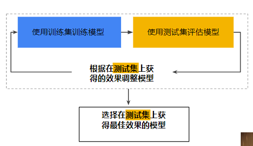

**“调整模型”**指的是调整您可以想到的关于模型的任何方面，从更改学习速率、添加或移除特征，到从头开始设计全新模型。 

这样的话，可能会对测试数据进行了过拟合。因此需要再划分数据集划分出一个新的部分---**验证集**。  


使用**验证集**评估训练集的效果。然后，在模型“通过”验证集之后，使用测试集再次检查评估结果。 

**使用验证集中的数据来调整模型，直到在验证集上获得最佳效果的模型，才使用测试集来确认模型的效果。  并确保测试数据上得到的结果符合验证数据得到的结果。如果不符合，则说明对验证集进行了过拟合。**

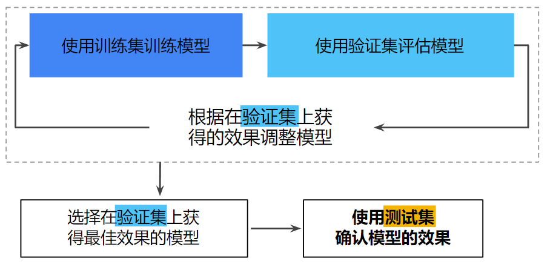


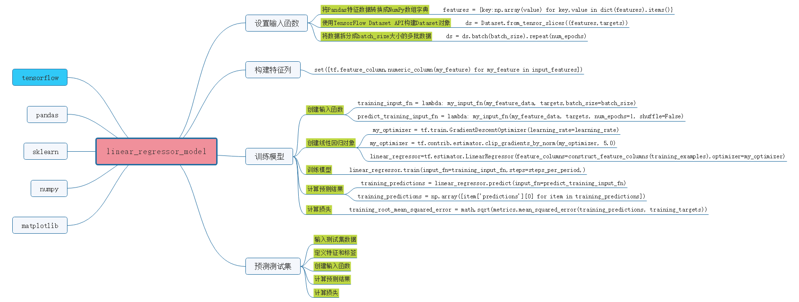

 

---------------------------------------

## 表示（Representation）：特征工程  

*机器学习模型不能直接看到、听到或感知输入样本。必须自己创建数据**表示**，为模型提供有用的信号来了解数据的关键特性。*---------为了训练模型，必须选择最能代表数据的特征集。  

> 从各种各样的数据集中提取数据，将输入的数据映射为实用的机器学习特征，创建特征向量，并选择出合适的特征，处理离群值。  

### 从原始数据到特征：  

具体的原理是将左侧矢量的每个部分映射到右侧**特征矢量**（组成数据集中样本的浮点值集）的一个或多个字段。  

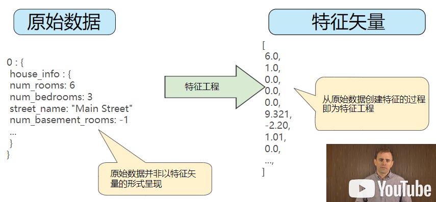

**特征工程**----从原始数据创建特征的过程，将原始数据转换为特征矢量。

* 如果数据为一个实值，则可以直接复制这个实值到特征向量。 
* 如果数据为一个字符串，则使用独热编码（one_hot_encoding)按照字典的形式将字符串映射为{0, ...,V-1} 内的某个整数。  
  * 首先为需要表示的所有特征的字符串定义一个词汇表。
  * 再使用该词汇表创建一个**独热编码**，用于将指定字符串表示为二元矢量。在该矢量中（与指定的字符串值相对应）：  
    * 只有一个元素设为1.
    * 其他所有元素均设为0.  
    * 该矢量的长度等于词汇表中的元素数。

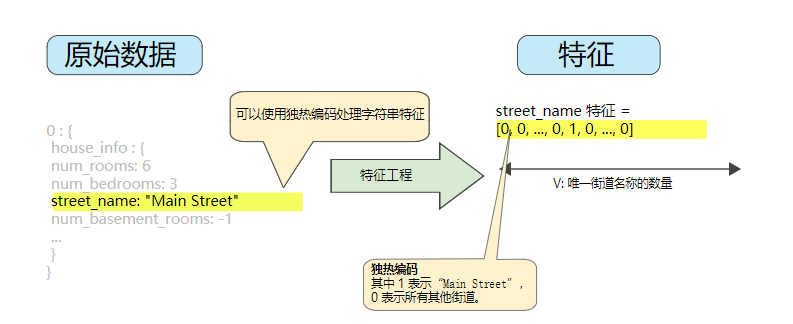  

### 映射分类（枚举）值:  

分类特征具有一组离散的可能值时，也就是说某个值可能属于多个类。那么就可以将分类特征编码为枚举类型或表示不同值的整数离散集。在机器学习中，通常将每个分类特征表示为单独的布尔值。

### 良好特征具备的特性：  

* 避免使用很少使用的离散特征值，大量离散值相同的样本可以让模型有机会了解不同设置中的特征，从而判断何时可以对标签很好地做出预测。特征值应以非零值的形式在数据集中多次出现。

  `错误：my_device_id:8SK982ZZ1242Z`

  `正确：device_model:galaxy_s6`  

* 特征应该具有清晰明确的含义：  

  `正确：user_age:23`

  `错误：user_age:123456789`

* 特征不应使用“神奇”的值（使用额外的布尔值特征），良好的浮点特征不包含超出范围的异常断点或“神奇”的值：  

  `错误：watch_time: -1.0`

  `正确：watch_time: 1.023`

  `正确：atch_time_is_defined: 1.0`  

  * 为解决神奇值的问题，需将该特征转换为两个特征：
    - 一个特征只存储质量评分，不含神奇值。
    - 一个特征存储布尔值，表示是否提供了 `watch_time`。为该布尔值特征指定一个名称，例如 `is_watch_time`。

* 特征的定义不应随着时间发生变化（数据的平稳性）：  

  `正确：city_id:"br/sao_paulo"`

  `错误：inferred_city_cluster_id:219`  

* 分布不应包含离谱的离群值（为特征设置上限或置换特征。理想情况下，所有特征都要转换为相似范围，例如（-1,1）或（0,5）。

### 分箱技巧：    

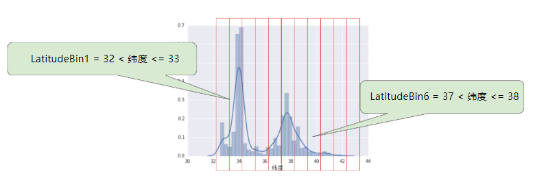

- 如上图所示，按照整数分箱后拥有了11个不同的布尔值特征（`LatitudeBin1`、`LatitudeBin2`、…、`LatitudeBin11`），而不是一个浮点特征。 
- 这样可以将部分非线性关系映射到模型中。
- 创建若干个布尔值箱，每个箱映射到新的唯一特征。
- 允许模型为每个箱拟合不同的值。
- 分箱以后，模型就可以为每个维度学习完全不同的权重。
- *可以按照分位数分箱，可以确保每个桶中的样本数量是相等的。按分位数分箱完全无需担心离群值。*

### 良好习惯

**了解数据**：

- **可视化**：绘制直方图或散点图，以及各种排名指标将数据直观的显示出来。从最普遍到最不普遍排列。
- **调试**：进行各种数据错误测试检查。重复样本？缺少值？离群值？数据与信息中心一致？训练数据与验证数据相似？
- **监控**：监控一段时间内的数据。特征分位数、样本数量随着时间推移有无变化？    

遵循以下规则：

- 记住您预期的数据状态。
- 确认数据是否满足这些预期（或者您可以解释为何数据不满足预期）。
- 仔细检查训练数据是否与其他来源（例如信息中心）的数据一致。

像处理任何任务关键型代码一样谨慎处理您的数据。良好的机器学习依赖于良好的数据。

### 清理数据：  

* **缩放特征值** ：指将浮点特征值从自然范围（例如 100 到 900）转换为标准范围（例如 0 到 1 或 -1 到 +1）。如果某个特征集只包含一个特征，则缩放可以提供的实际好处微乎其微或根本没有。不过，如果特征集包含多个特征，则缩放特征可以带来以下优势：
  - 帮助梯度下降法更快速地收敛。
  - 帮助避免“NaN 陷阱”。在这种陷阱中，模型中的一个数值变成 [NaN](https://wikipedia.org/wiki/NaN)（例如，当某个值在训练期间超出浮点精确率限制时），并且模型中的所有其他数值最终也会因数学运算而变成 NaN。
  - 帮助模型为每个特征确定合适的权重。如果没有进行特征缩放，则模型会对范围较大的特征投入过多精力

> 要缩放数字数据，一种显而易见的方法是将$ [最小值，最大值]$ 以线性方式映射到较小的范围，例如 [-1，+1]。 
>
> 另一种热门的缩放策略是计算每个值的 Z 得分。Z 得分与距离均值mean的标准偏差数stddev相关。换而言之：
>
> $$scaled value = (value - mean) / stddev.$$
>
> 使用 Z 得分进行缩放意味着，大多数缩放后的值将介于 -3 和 +3 之间，而少量值将略高于或低于该范围。   

### 处理极端离群值：  

* 对每个值取对数。  
* 将特征值限制到一定的范围。  

### 清查：  

在现实生活中，数据集中的很多样本是不可靠的。原因有：  

* **遗漏值。** 例如，有人忘记为某个房屋的年龄输入值。
* **重复样本。** 例如，服务器错误地将同一条记录上传了两次。
* **不良标签。** 例如，有人错误地将一颗橡树的图片标记为枫树。
* **不良特征值。** 例如，有人输入了多余的位数，或者温度计被遗落在太阳底下。  

一旦检测到存在这些问题，通常需要将相应样本从数据集中移除，从而“修正”不良样本。  

除了检测各个不良样本之外，您还必须检测集合中的不良数据。直方图是一种用于可视化集合中数据的很好机制。此外，收集如下统计信息也会有所帮助：

- 最大值和最小值
- 均值和中间值
- 标准偏差

---------------------------------------------------------

## 特征组合（Feature Crosses）：对非线性规律进行编码    

**特征组合**是指两个或多个特征相乘来对特征空间中的非线性规律进行编码的**合成特征**。特征的相乘组合可以提供超出这些特征单独能够提供的预测能力。  使用名为**交叉乘积**的简单合成特征，可以在线性模型中学习非线性规律。  

* **特征组合**是这种方法的名称
* 定义 `[A x B]` 形式的模板：将两个特征的值相乘形成的特征组合。
* 可以比较复杂：`[A x B x C x D x E]`：将多个特征的值进行相乘。
*  `[A x A]`  ：对单个特征的值求平方形成的特征组合。
* 当 `A` 和 `B` 表示布尔特征（例如分箱）时，所得到的组合可能会极其稀疏。  （独热编码可能拥有大量0值）

### 一些示例  

- **房价预测器：**

  `[latitude X num_bedrooms]`

- **井字游戏预测器：**

  `[pos1 x pos2 x ... x pos9]`

### 特征组合：我们为什么要这么做？

- 线性学习器可以很好地扩展到大量数据，例如 vowpal-wabit、sofia-ml

- 不过，如果不使用特征组合，这些模型的表现度将受到限制

- 使用特征组合 + 大量数据是学习高度复杂模型的一种有效策略

- - 预示：神经网络可提供另一种策略  
  - 将通过特征交叉乘积获得的线性学习效果与深度网络相结合，可以实现及其强大的建模能力。    

### 特征组合 (Feature Crosses)：组合独热矢量  

机器学习模型很少会组合连续特征。但机器学习模型却经常组合独热特征矢量，将独热特征矢量的特征组合视为逻辑连接。 

例如，假设我们具有以下两个特征：国家/地区和语言。对每个特征进行独热编码会生成具有二元特征的矢量，这些二元特征可解读为 `country=USA, country=France` 或 `language=English, language=Spanish`。然后，如果您对这些独热编码进行特征组合，则会得到可解读为逻辑连接的二元特征，如下所示：

```
  country:usa AND language:spanish
```

> 加利福尼亚州不同城市的[房价](https://developers.google.com/machine-learning/crash-course/california-housing-data-description)有很大差异。假设您必须创建一个模型来预测房价。以下哪组特征或特征组合可以反映出特定城市中 `roomsPerPerson` 与房价之间的关系？
>
> 一个特征组合：`[binned latitude X binned longitude X binned roomsPerPerson]`
>
> 解析:将分箱纬度与分箱经度组合可以让模型了解 roomsPerPerson 特定于城市的效果。分箱可防止纬度变化与经度变化产生相同的效果。根据箱的精细程度，此特征组合可以反映出特定于城市、特定于社区，甚至特定于街区的效果。

-----------------------------

## 简化正则化（Regularization for Simplicity）  

**正则化**指的是降低模型的复杂度以减少过拟合。  ------也就是不要过于信赖样本。

*早停法：在训练数据的效果实际收敛前停止训练。*

### 降低模型的复杂度:

- 我们希望尽可能降低模型的复杂度。

- 我们可以将这种想法纳入训练时所进行的优化中。

- 经验风险最小化(确保获取正确的训练数据，但又不过度信赖训练数据以免使模型过于复杂。）：

  - 旨在减少训练误差，只是以最小化损失为目标：

    $\text{minimize: } Loss(Data\;|\;Model)$

- 同时平衡复杂度，以最小化损失和复杂度为目标，称为**结构风险最小化**：  


> 这时训练优化算法由两项组成：  
>
> * **损失项**：用于衡量模型与数据的拟合度。
> * **正则化项**：用于衡量模型复杂度。

* 在该课程中，重点介绍两种衡量模型复杂度的常见方式：
  * 将模型复杂度作为模型中**所有特征**的权重函数。（如果特征权重的绝对值越高，对模型复杂度的贡献就越大）
  * 将模型复杂度作为具有**非零权重的特征总数**的函数。

### 正则化：

- 如何定义复杂度（模型）？

- 首选较小的权重

- 偏离将会产生成本

- 可以通过 L2 **正则化**（也称为岭正则化）对这种想法进行编码

- - *复杂度（模型）= 权重的平方和*

    $||w||_2^2=w_1^2+w_2^2+...+w_n^2$

  - 减少非常大的权重

  - 离群值的权重会产生巨大的影响。

  - 对于线性模型：首选比较平缓的斜率

  - 贝叶斯先验概率：

  - - 权重应该以 0 为中心
    - 权重应该呈正态分布

### L2 正则化的损失函数

$$L(w,D)+\lambda||w||_2^2$$

Where:

$L$:损失项（取决于训练数据）旨在减少训练误差。 $\lambda$: 控制如何平衡权重的标量值。 $w$:平衡复杂度。 $_2^2$：权重标准化的$L_2$平方。  

* 第二项与数据无关，只是要简化模型。两项通过**正则化率**$\lambda$实现了平衡（这个系数代表了对获取正确样本与对简化模型的关注程度之比）。

* 增加lambda值将会增强正则化效果。例如，lambda值较高的权重直方图可能会如下图所示：  

  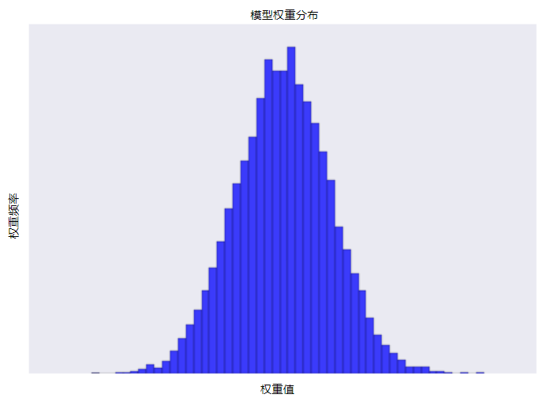

* 降低lambda值会得到比较平缓的直方图，如下图所示：  

  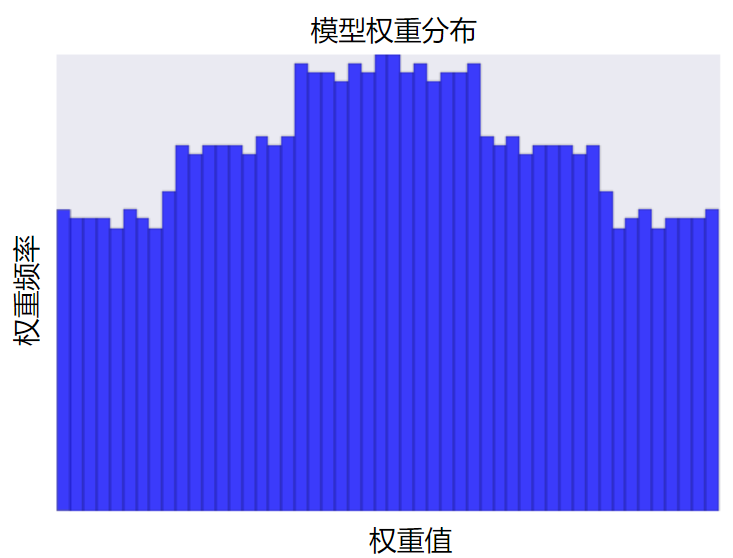

* 在选择lambda值时，目标是在简单化和训练数据拟合之间达到适当的平衡：

  * 值过高，则模型会非常简单，但是会面临数据欠拟合的风险。模型将会无法从训练数据中获得足够的信息来做出有用的预测。

  * 值过低，则模型会变得比较复杂，并且将面临数据过拟合的风险。模型将因获得过多训练数据特点方面的信息而无法泛化到新数据。

    *注意：将 lambda 设为 0 可彻底取消正则化。 在这种情况下，训练的唯一目的将是最小化损失，而这样做会使过拟合的风险达到最高*

* 如果拥有大量训练数据，且他们和测试数据看起来一直差不多，则不需要进行多少正则化。

* 如果训练数据不多，或者训练数据与测试数据有所不同那么需要进行大量正则化。

> 学习速率和lambda之间存在密切关联。强$L_2$正则化值往往会使特征权重更接近于0。
>
> 较低的学习速率（使用早停法）通常也会产生相同的效果，因为与0的距离并不是很远。
>
> 因此，同时调整学习速率和lambda可能会产生令人混淆的效果。
>
> **早停法**指的是在模块完全收敛之前就结束训练。
>
> 为了避免混淆，可以在训练一批固定的数据时，执行足够多次迭代，让早停法不起作用。

假设某个线性模型具有 100 个输入特征：

* 其中 10 个特征信息丰富。
* 另外 90 个特征信息比较缺乏。

假设所有特征的值均介于 -1 和 1 之间。 以下哪些陈述属实？  

* L2 正则化可能会导致对于某些**信息缺乏**的特征，模型会学到适中的权重。
  * 出乎意料的是，当某个信息缺乏的特征正好与标签相关时，便可能会出现这种情况。在这种情况下，模型会将本应给予信息丰富的特征的部分“积分”错误地给予此类信息缺乏的特征。
* L2 正则化会使很多信息缺乏的权重接近于（但并非正好是）0.0。
  * 正确。L2 正则化会使权重接近于 0.0，但并非正好为 0.0。  


假设某个线性模型具有两个密切相关的特征；也就是说，这两个特征几乎是彼此的副本，但其中一个特征包含少量的随机噪点。如果我们使用 L2 正则化训练该模型，这两个特征的权重将出现什么情况？   

* 这两个特征将拥有几乎相同的适中权重。

  * L2 正则化会使特征的权重几乎相同，大约为模型中只有两个特征之一时权重的一半。  

-----------------------

## 逻辑回归（Logistic Regression）  

**逻辑回归**会生成一个介于0到1之间（不包括0和1）的概率值，而不是确切地预测结果是0还是1。---也就是指生成一个样本属于某一类的概率。  

* 通过逻辑回归会获得校准良好的概率。

- 许多问题需要将概率估算值作为输出
- 输入**逻辑回归**。
- 很方便，因为概率估算值已经过**校准**
  - 例如，p（待出售房屋）* 价格 = 预期结果    
- 此外，它在我们需要二元分类时非常有用
  - 垃圾邮件或非垃圾邮件？→ p（垃圾邮件）

### 逻辑回归------预测  

$y'=\frac{1}{1+e^{-(z)}}$

Where:  

* $x$：提供熟悉的线性模型，特定样本的特征值。
* y' 是逻辑回归模型针对特定样本的输出。
* $z=b+w_1x_1+w_2x_2+...w_nx_n$
* $1+e^{-(z)}$：应用S型函数。-----提供0到1之间的有界值。    
  * 其中，z也称为**对数几率**，因为S型函数的反函数表明，z可定义为标签“1”的概率除以标签“0”的概率得出的值的对数：$z=log(\frac{y}{1-y})$

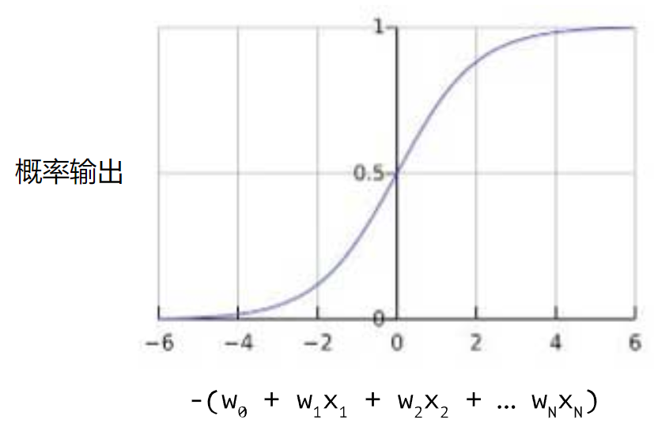

### 模型训练：

### 对数损失函数的定义：  

$LogLoss=\sum_{(x,y)\in D}-ylog(y')-(1-y)log(1-y')$

其中：  

* $(x,y\in D)$是包含很多有标签样本（x，y）的数据集。
* “y”是有标签样本中的标签。在逻辑回归这里，“y”的每个值必须是0或1。
* “y`”是对于特征集“x”的预测值（介于0和1之间）。

> 对数损失函数的方程式与 [Shannon 信息论中的熵测量](https://wikipedia.org/wiki/Entropy_(information_theory))密切相关 ，也是[似然函数](https://wikipedia.org/wiki/Likelihood_function)的负对数（假设“y”属于[伯努利分布](https://wikipedia.org/wiki/Bernoulli_distribution)）。实际上，**最大限度地降低损失函数的值会生成最大的似然估计值。 **

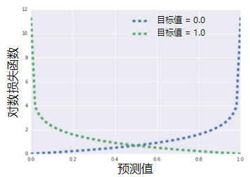

### 逻辑回归和正则化

- 正则化对于逻辑回归而言至关重要。

- - 记住渐近线
  - 它会不断尝试促使损失在高维度空间内达到 0

- 以下两个策略尤其有用：

- - **L2 正则化**（也称为 L2 权重衰减）- 确保权重不会严重失衡，用于降低超大权重。
  - **早停法** - 用于限制训练步数或学习速率。

### 线性逻辑回归

- 线性逻辑回归极其高效。

- - 超快的训练速度和较短的预测时间。
  - 短模型/宽度模型占用大量 RAM。
  - **可以扩展到庞大的数据。**

- *如果需要非线性逻辑回归，则可以通过添加特征交叉乘积来实现。*  

### 计算概率：  

*逻辑回归是一种极高效的概率计算机制。*  

有两种方式来使用返回的概率：  

* “按原样”----直接使用计算出的概率。
* 转换成二元类别 ----**将逻辑回归的输出映射到二元分类问题的解决方案。**  
  * 二元分类问题的目标是正确预测两个可能的标签中的一个。

---------------------------

## 分类（Classification）  

### 分类与回归  

为了将逻辑回归值映射到二元类别，则必须指定**分类阈值**（也称**判定阈值**）。

- 有时，我们会使用逻辑回归（一种介于 (0, 1) 之间的回归）来获得概率输出。
- 在其他时候，我们会对离散二元分类的值设定阈值
- 阈值的选择非常重要，我们可以对阈值进行调整   

**注意**：“调整”逻辑回归的阈值不同于调整学习速率等超参数。在选择阈值时，需要评估您将因犯错而承担多大的后果。 

### 评估指标：准确率：*模型预测正确的结果所占的比例。*

- 如何评估分类模型？  

- 一种可能的衡量指标：**准确率**-----正确结果数除以总数。

  - 正确的预测所占的比例

  - 对于二元分类，也可以根据正类别和负类别按如下方式计算准确率：

    $Accuracy = \frac{TP+TN}{TP+TN+FP+FN}$

### 准确率可能具有误导性

* 在很多情况下，准确率是一个欠佳或具有误导性的指标
  * 最常是在不同类型的错误具有不同的代价时
  * 典型情况包括分类不平衡，即正类别或负类别极其罕见时
  * 当您使用**分类不平衡的数据集**（比如正类别标签和负类别标签的数量之间存在明显差异）时，单单准确率一项并不能反映全面情况。 

### 真正例和假正例

- 对于分类不平衡问题，区分不同类型的错误会有所帮助，可以使用一个“混淆矩阵”来总结模型：

| **真正例 (TP)：**真实情况：受到狼的威胁。牧童说：“狼来了。”结果：牧童是个英雄。 | **假正例 (FP)：**真实情况：没受到狼的威胁。牧童说：“狼来了。”结果：村民们因牧童吵醒他们而感到非常生气。 |
| ------------------------------------------------------------ | ------------------------------------------------------------ |
| **假负例 (FN)：**真实情况：受到狼的威胁。牧童说：“没有狼”。结果：狼吃掉了所有的羊。 | **真负例 (TN)：**真实情况：没受到狼的威胁。牧童说：“没有狼”。结果：大家都没事。 |

**真正例**是指模型将正类别样本正确地预测为正类别。同样，**真负例**是指模型将负类别样本正确地预测为负类别。

**假正例**是指模型将负类别样本错误地预测为正类别，而**假负例**是指模型将正类别样本错误地预测为负类别。

### 评估指标：精确率和召回率

- **精确率**：在被识别为正类别的样本中，确实为正类别的比例是多少？ 

- （真正例次数）/（所有正类别预测次数）-----也就是小男孩说“狼来了”，其中有多少次是对的。

- 精确定义为：

  $Precision=\frac{TP}{TP+FP}$

- - 当模型的预测为“正”类别时，预测正确吗？
  - 直觉：模型是否过于频繁地提醒说“狼来了”？

- **召回率**：在所有正类别样本中，被正确识别为正类别的比例是多少？ 

- （真正例次数）/（所有实际正类别数）----指的是在真正进入村庄的狼中，我们发现了多少头。

- 精确定义为：

  $召回率=\frac{TP}{TP+FN}$

- - 直觉：是否漏掉了任何“狼来了”的情况？

*上述两个指标往往处于“此消彼长”的状态。*  

要全面评估模型的有效性，必须同时检查精确率和召回率。

> 让我们以一种将电子邮件分为“垃圾邮件”或“非垃圾邮件”这两种类别的分类模型为例。如果提高分类阈值，精确率会怎样？   
>
> 可能会提高。------- 一般来说，提高分类阈值会减少假正例，从而提高精确率。

尝试使用许多不同的分类阈值来评估我们的模型。

### ROC 曲线（接受者操作特征曲线）：是一种显示分类模型在所有分类阈值下的效果的图表。

每个点都是一个判定阈值所对应的 TP 率（也就是召回率）和 FP 率。

**ROC曲线用于绘制采用不同分类阈值时的TPR和FPR。降低分类阈值会导致将更多样本归为正类别，从而增加假正例和真正例的个数。**

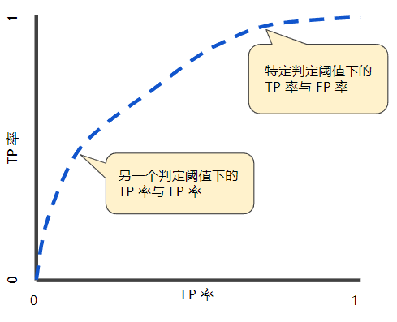

#### 评估指标：曲线下面积

- 曲线下面积：“ROC 曲线下面积”-----曲线下面积测量的是从 (0,0) 到 (1,1) 之间整个 ROC 曲线以下的整个二维面积 。

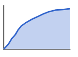

- 解释：

- 曲线下面积的一种解读方式是看作模型将某个随机正类别样本排列在某个随机负类别样本之上的概率。 

- - 如果随机选择一个正类别样本和一个负类别样本，我的模型能够以正确顺序排列它们的概率是多少？ROC曲线下方的面积值。----正确配对比较结果的概率。
  - 直觉：对所有可能的分类阈值的汇总效果进行综合衡量

曲线下面积因以下两个原因而比较实用：

- 曲线下面积的**尺度不变**。它测量预测的排名情况，而不是测量其绝对值。
- 曲线下面积的**分类阈值不变**。它测量模型预测的质量，而不考虑所选的分类阈值。

这可能会导致曲线下面积在某些用例中不太实用：

- **并非总是希望尺度不变。** 例如，有时我们非常需要被良好校准的概率输出，而曲线下面积无法告诉我们这一结果。
- **并非总是希望分类阈值不变。** 在假负例与假正例的代价存在较大差异的情况下，尽量减少一种类型的分类错误可能至关重要。例如，在进行垃圾邮件检测时，您可能希望优先考虑尽量减少假正例（即使这会导致假负例大幅增加）。对于此类优化，曲线下面积并非一个实用的指标。

#### 预测偏差

- 逻辑回归预测应当无偏差。

- - 预测平均值 == 观察平均值
  - **预测偏差**指的是这两个平均值之间的差值。 
    - `预测偏差=预测平均值-数据集中相应标签的平均值 `

- 偏差是一个具有指示作用的值。

- - 仅仅是零偏差并不能说明您系统中的一切都完美无缺。
  - 但偏差是一项非常实用的健全性检查项目。

- 如果出现偏差，则说明存在问题。

- - 特征集不完整
  - 数据集混乱
  - 模型实现流水线中有错误？
  - 训练样本有偏差
  - 正则化过强

- 请勿使用校准层来修正偏差，而应在模型中予以修正。原因为：

  - 这样修复的是症状，而不是原因。
  - 这样建立了一个更脆弱的系统，并且必须持续更新。

- 查看各部分数据中是否存在偏差 -----这有助于指导如何进行改进。

#### 分桶偏差和预测偏差

只有将足够的样本组合在一起以便能够比较预测值（例如 0.392）与观察值（例如 0.394），逻辑回归的预测偏差才有意义。 

* 可以通过以下方式构建桶：
  * 以线性方式分解目标预测。
  * 构建分位数。

以下某个特定模型的校准曲线。每个点表示包含 1000 个值的分桶。两个轴具有以下含义：

- x 轴表示模型针对该桶预测的平均值。
- y 轴表示该桶的数据集中的实际平均值。

两个轴均采用对数尺度。 

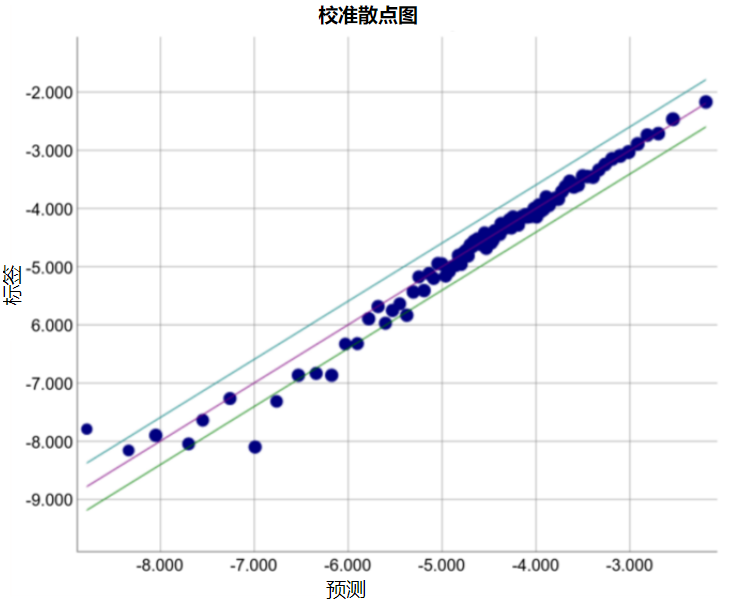

为什么只有模型的某些部分所做的预测如此糟糕？以下是几种可能性：

- 训练集不能充分表示数据空间的某些子集。
- 数据集的某些子集比其他子集更混乱。
- 该模型过于[正则化](https://developers.google.com/machine-learning/crash-course/regularization-for-simplicity/video-lecture)。（不妨减小 [lambda](https://developers.google.com/machine-learning/crash-course/glossary#lambda) 的值。）

-------------------------------------------

## 稀疏性正则化（Regularization for Sparsity）     

多维度特征矢量的模型的特殊要求。  

### 让我们返回到特征组合

- **注意**：稀疏特征组合可能会大大增加特征空间

- 可能出现的问题：

- - 模型大小 (RAM) 可能会变得庞大，减缓运行时间
  - “噪点”系数（导致过拟合）
  - **这就需要以特定方式进行模型正则化-。**    

在高维度稀疏矢量中，最好尽可能使权重正好降为0。正好为0的权重基本上会使相应特征从模型中移除。

### L1 正则化

- 会对权重的 L0 范数进行惩罚（-将部分权重设为0）---*创建一个正则化项，减少模型中的非零系数值的计数。只有在模型能够与数据拟合时增加此计数才有意义。*

- - 非凸优化；NP 困难

- 比较放松的**L1 正则化**：

- - 对绝对值（权重）之和进行惩罚
  - 凸优化问题
  - 和 L2 不同，L1 鼓励稀疏性---**会让很多稀疏归0**。
    - L2正则化降低$权重^2$
    - L1会降低$|权重|$
    - 因此他们具有不同的导数：
      - L2的导数为$2*权重$
      - L1的导数为$k$（一个常数，其值与权重无关）  

> L1 正则化 - 减少所有权重的绝对值 - 证明对宽度模型非常有效。
>
> 请注意，该说明适用于一维模型。  

假设某个线性模型具有 100 个输入特征： 

	* 其中 10 个特征信息丰富。
	
	* 另外 90 个特征信息比较缺乏。

*L1 正则化可能会使信息丰富的特征的权重正好为 0.0。*

	* 信息缺乏的特征。
	
	* 不同程度的信息丰富的特征。

* 与其他类似的信息丰富特征密切相关的信息丰富特征。

-----------------------------------------------------------------------

## 神经网络简介（Introduction to Neural Networks）    

神经网络是更复杂标本的特征组合。实质上，神经网络会学习适合我们需求的相应特征组合。  

对于较复杂的数据，会希望模型自行学习数据的非线性规律，而不是需要我们指定参数。  

线性问题： 


### 隐藏层

需要给模型添加一些额外结构---**隐藏层**表示中间值。但下图的模型仍然是线性的：


### 激活函数

要对非线性问题进行建模，需要引入非线性函数，非线性函数将每个隐藏层连接起来，由多个线性函数进行组合，并添加非线性函数---**激活函数**：  


### 常见的激活函数  

* S型函数：将加权和转换为介于0和1之间的值：  

  $F(x)=\frac{1}{1+e^{-x}}$

  曲线如下：  

  

* **修正线性单元**激活函数**ReLU**，可位于任意隐藏层节点的输出中，他的优势在于他基于实证发现，拥有更实用的响应范围。他的响应性在两端相对较快地减少：

  $F(x)=max(0,x)$


实际上，所有的数学函数均可作为激活函数。假设$\sigma$表示激活函数。那么，网络中节点的值由以下公式指定：  

$\sigma(\mathbb{w \cdot x}+b)$  

### **总结：**

现在，我们的模型拥有了人们通常所说的“神经网络”的所有标准组件：

- 一组节点，类似于神经元，位于层中。
- 一组权重，表示每个神经网络层与其下方的层之间的关系。下方的层可能是另一个神经网络层，也可能是其他类型的层。
- 一组偏差，每个节点一个偏差。
- 一个激活函数，对层中每个节点的输出进行转换。不同的层可能拥有不同的激活函数

* 但是训练该非线性模型是非凸优化，因此需要我们对输入进行进行初始化。
* 在训练这个模型使用的方法叫**反向传播**，是梯度下降法的变形。通过反向传播能够以高效的方式对非凸优化问题执行梯度下降。

----------------------------------------------

## 训练神经网络（Trainging Neural Netws）    

**反向传播**是一种常见的神经网络训练算法。使用这种方法，梯度下降法在多层神经网络中将成为可行方法。  

在TensorFlow中，不用了解反向传播的实施方式。  

### 反向传播：注意事项

- 梯度很重要

- - 如果它是可微的，则我们也许能够对其进行学习

- 梯度可能会消失

- - 如果网络太过于深入，每个额外的层都会依次降低信噪比（限制网络的最小深度）
  - 当较低层的梯度逐渐消失到 0 时，这些层的训练速度会非常缓慢，甚至不再训练。 
  - ReLu 在这里很有用

- 梯度可能会爆炸

  - 网络中的权重过大，则较低层的梯度会涉及许多大项的乘积。 ---梯度过大导致难以收敛。

- - 学习速率在这里很重要，如果过高
  - 批标准化（实用按钮）可以提供帮助

- ReLu 层可能会消失

  - 加权和低于0

- - 保持冷静，并降低您的学习速率

### 标准化特征值

- 我们希望特征具有合理的范围

- - 大致以 0 为中心，[-1, 1] 的范围通常效果比较好
  - 有助于梯度下降法收敛；避免 NaN 陷阱
  - 避免离群值也会有帮助

- 可以使用一些标准方法：

- - 线性缩放
  - 为最大值和最小值设定硬性上下限（截断）
  - 对数缩放

### 丢弃正则化

- **丢弃**：*针对概率P取一个节点，然后从网络的一个梯度步长中将其移除。并对其他步长重复此过程，随机选择节点进行丢弃。*另一种正则化形式，对神经网络很有用，节点丢弃得越多，正则化效果就越强。

- 工作原理是，在一个梯度步长中随机“丢弃”网络的单元

- - 有一个可用于集成学习此处的模型的连接

- 丢弃得越多，正则化效果就越强

- - 0.0 = 无丢弃正则化
  - 1.0 = 丢弃所有内容！学不到任何规律
  - 中间值更有用  

> 学习速率和神经网络层数：层数和节点数过多，模型训练很慢，模型的可解释性很不好，则需要减少层数和节点数，使用较低的学习效率。使用正则化改善过拟合和模型复杂度，但不能过高。如果数据的噪声更多，可以选择添加一些更复杂的特征。